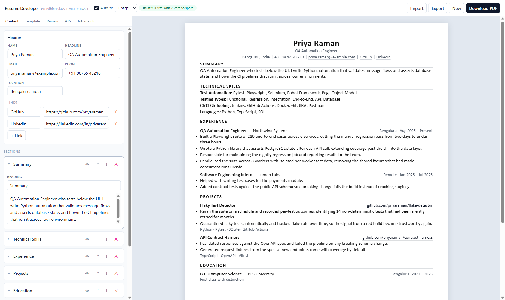
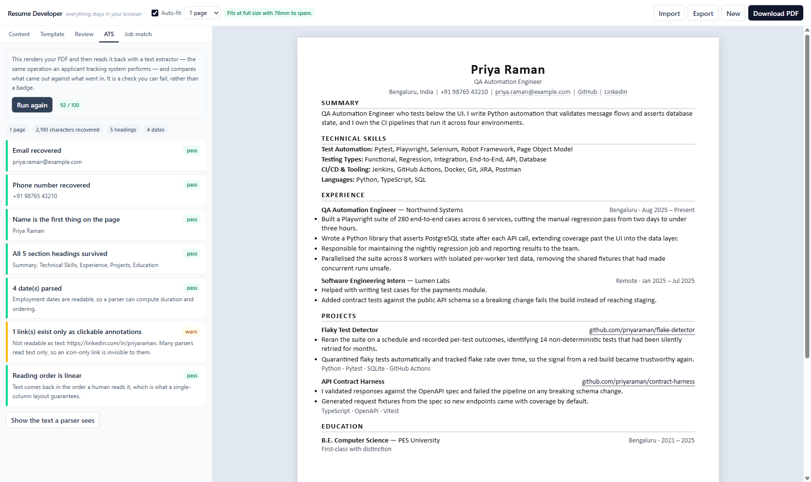
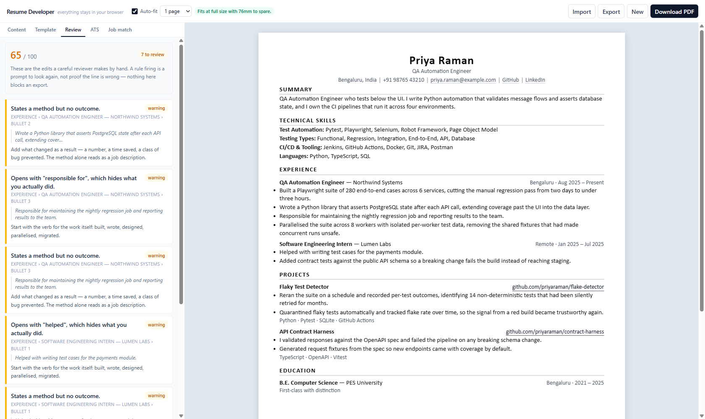
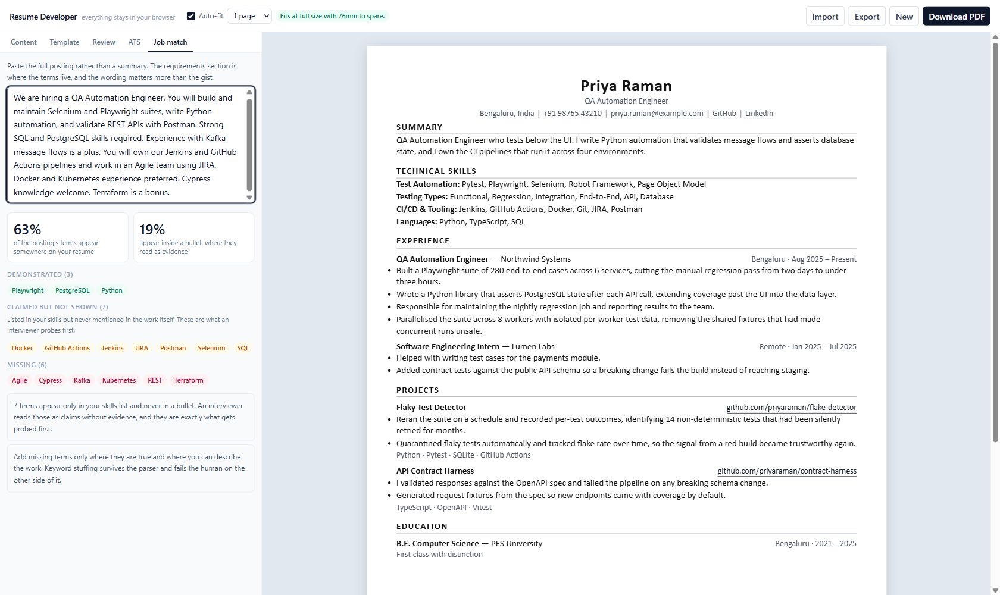

# Resume Developer

A resume builder whose two hard parts are the ones other builders skip: fitting a
document to an exact page count automatically, and proving that an applicant
tracking system can actually read what you exported.

Everything runs locally. There are no accounts and nothing is uploaded — a resume
is the most identifying document most people own, and the safest place to process
one is the machine it already lives on.

```bash
npm install
npx playwright install chromium   # used for PDF rendering, not just tests
npm run dev                       # http://localhost:3000
```



## What it does that a template gallery does not

**Fits to a page count instead of asking you to.** Most builders let the document
overflow and leave you nudging font sizes until it stops. This one treats it as a
search problem: it renders the document off-screen at a candidate scale, measures
the real height, and binary-searches for the largest scale that still fits your
target. Nine probes settle it in about 25ms, so it runs as you type.

Spacing and type are not scaled together. Whitespace shrinks by `scale ** 1.6`
while text shrinks linearly, because squeezing gaps by 20% is invisible and
dropping body text by 20% is not. When even the minimum readable size will not
fit, it stops and tells you roughly how many lines to cut rather than shrinking
into unreadability.

**Verifies ATS compatibility rather than claiming it.** "ATS-friendly" is an
unfalsifiable badge on every competing product. Here, the ATS tab renders your
PDF, reads the text layer back out — the same operation a parser performs — and
compares what came out against what went in. Was the email recoverable? Did every
section heading survive as its own line? Did the dates parse? Is the reading order
linear, or does it show the interleaving signature of a multi-column layout?

It is a check that can fail, including on the app's own output. The bundled sample
scores 92 rather than 100, because a link whose label reads "LinkedIn" leaves its
URL only in a PDF annotation, and many parsers read text only.



**1,080 templates from six layouts.** A template here is a composition —
layout × type pairing × density × accent — not a file. Six layouts, six type
pairings, three densities and ten accents multiply out to 1,080 combinations, and
every one inherits the properties that make the layouts safe.

Every layout is single column. Two-column resumes with sidebars are the most
common cause of parse failure, because an extractor reads the file in content
order and splices the columns together mid-sentence. Ruling them out at the layout
level is what lets the product claim safety by construction; the parse-back check
is what proves it.

**Content linting.** The rules encode the edits a careful reviewer makes by hand:
bullets that state a method with no outcome, weak openers like "Responsible for",
first person, filler phrases, vague quantifiers where a number would do,
placeholders that were never filled in. Nothing blocks an export — a rule firing
is a prompt to look again, not proof the line is wrong.



**Job-description matching with one refinement.** Coverage percentage alone is
gameable by dumping terms into a skills list, so the analysis separates a term
that appears inside a bullet from one that appears only as a claim. The first is
evidence; the second is what an interviewer probes first. The term universe is a
curated dictionary plus whatever you have listed yourself, so it still works in
domains the dictionary has never heard of.



## Design decisions worth knowing about

**The preview and the PDF cannot drift.** They are the same React component and
the same stylesheet. The export path serialises `ResumeBody` with
`renderToStaticMarkup`, wraps it in a standalone HTML document with the same CSS,
and hands that to Playwright. Nothing about the export re-implements the layout.

**The document does not use Tailwind.** Tailwind styles the application chrome,
but the resume itself is plain CSS driven by custom properties, because the PDF is
rendered from an HTML string with no build step available.

**Page margins live in one place.** `.rd-page` supplies them as padding and
`@page` margin is zero. Setting both is the classic way to silently lose about
20mm of vertical space, which is exactly the difference between one page and two.

**Measurement overrides `min-height`.** The fit solver needs the document's
natural height; leaving the page's `min-height` in place would floor every
measurement at one full page and the search would never observe an overflow.

**The solver keeps the best scale it actually measured.** Height is assumed
non-increasing as scale decreases, which text reflow makes very slightly untrue at
the boundaries — a tightened line can wrap into an extra one. Rather than trusting
the final bound, the search returns a scale it has observed to fit.

**Hydration reads storage once.** The saved document lives in `localStorage`,
which does not exist during server rendering. Instead of mounting the editor and
correcting it from an effect — which flashes the sample over your real document —
the shell waits for hydration via `useSyncExternalStore` and the editor reads
storage in its initialiser.

## Architecture

```
src/lib/
  schema.ts              Zod document model; sections are an ordered typed list
  templates/tokens.ts    The composition space and its CSS custom properties
  templates/document.tsx Pure renderer, shared by the preview and the PDF
  templates/styles.ts    The one stylesheet both paths use
  fit/autofit.ts         Pure solver — no DOM, fully unit tested
  fit/use-auto-fit.tsx   Off-screen measurement that drives the solver
  lint/rules.ts          Content rules
  jd/keywords.ts         Job-description matching
  ats/parse.ts           Pure analysis of extracted text
  ats/lines.ts           Reconstructs visual lines from glyph positions
  limits/rate-limit.ts   Token bucket, injectable clock
  limits/semaphore.ts    Concurrency ceiling with queue timeouts
  limits/body.ts         Streaming body reader with a byte cap
  server/render-pdf.tsx  Playwright rendering
  server/extract-pdf.ts  pdfjs text extraction
  server/font-embed.ts   Inlines the woff2 files as data URIs
  server/gate.ts         Applies the limits above to a request
```

The pure modules hold the logic worth testing and none of them touch a browser or
a filesystem, which is why the unit suite runs in about a second.

## Fonts

Every font is shipped with the app, which is a correctness requirement rather
than a preference. Auto-fit measures in your browser but the PDF is printed by a
Chromium process that may be on another machine: if the two resolve a font stack
differently — and they will, because Calibri and Georgia do not exist on Linux —
one measures a set of line breaks the other does not reproduce, and a resume that
fitted on screen arrives as two pages.

So both sides load byte-identical files. `scripts/sync-fonts.mjs` reads
`src/lib/templates/fonts.json`, copies the woff2 files out of the `@fontsource`
packages into `public/fonts`, and generates both the browser's `@font-face`
rules and the unicode ranges the renderer embeds. It runs on `postinstall`,
`predev`, `prebuild` and `pretest`, so the generated files are never stale and
are not committed. The families are metric clones of the fonts people expect:
Carlito for Calibri, Arimo for Arial, Tinos for Times New Roman, Gelasio for
Georgia.

Before printing, the renderer loads every embedded face explicitly and fails the
request if any did not decode. It does not ask whether a family "is loaded" — a
browser only loads what it paints, so a family used solely for bold headings
never loads its regular weight, and that is not an error.

## Deployment

Rendering needs a real Chromium, which rules out the default serverless
runtimes. The image handles it:

```bash
docker compose up --build      # http://localhost:3000
curl localhost:3000/api/health
```

Roughly 2.3GB, most of it Chromium. It builds on a slim Node base and installs
only the one browser — the Playwright base image is convenient but carries
Firefox and WebKit too, and those cannot be removed afterwards because a layer
can only add. The server runs as a non-root user with all capabilities dropped.

`/api/health` reports whether the fonts are present, which is the failure worth
probing for: without them the app still returns a PDF, just one set in the wrong
typeface with a page count that no longer matches the preview. It deliberately
does not launch a browser, so probing it costs nothing.

Chromium's own sandbox is disabled in the container via
`RESUME_CHROMIUM_NO_SANDBOX=1`, because keeping it would mean granting
`SYS_ADMIN` to the whole container. If your platform can grant that capability,
unset the variable.

### Protecting the render endpoints

Both `/api/render` and `/api/ats` are unauthenticated and both start real
browser work, so they are gated before anything expensive happens:

| Variable | Default | What it does |
| --- | --- | --- |
| `RESUME_MAX_BODY_BYTES` | `524288` | Body ceiling, enforced while streaming rather than after buffering |
| `RESUME_RATE_CAPACITY` | `20` | Burst allowance per caller |
| `RESUME_RATE_REFILL_PER_MINUTE` | `20` | Sustained rate per caller |
| `RESUME_RENDER_CONCURRENCY` | `2` | Simultaneous renders; the rest queue |
| `RESUME_QUEUE_TIMEOUT_MS` | `20000` | How long a queued request waits before a 503 |

Over-limit callers get 429 with `Retry-After`, oversized bodies get 413, and a
saturated renderer gets 503 rather than an unbounded queue.

Two caveats worth stating plainly. Rate limiting keys on `x-forwarded-for`, which
is only trustworthy behind a proxy that overwrites it; exposed directly the
header is caller-controlled and the limit becomes advisory. And the state is
per-instance, so it protects one box from being overwhelmed rather than
enforcing a global quota across replicas.

## Tests

```bash
npm run test      # 102 unit tests
npm run test:e2e  # 19 end-to-end tests against a real build
npm run check     # typecheck, lint and unit tests
```

The unit suite covers the fit solver's search behaviour against synthetic
documents with known height curves, every lint rule, keyword matching including
aliases and punctuation-bearing terms like `C++` and `CI/CD`, the ATS analysis
including the column-interleaving detector, line reconstruction from glyph
positions, and the import/export round trip.

The end-to-end suite asserts the things that only a real render can: that the
exported PDF is a single A4 page, that all six layouts produce valid PDFs, that
the ATS route recovers the contact details from bytes it just generated, and that
edits survive a reload. It also covers the fit guarantee directly — a document
long enough that auto-fit must tighten it still has to export as one page — and
the limits, by driving a caller past its allowance and posting an oversized body.

If the e2e server fails to start with `EACCES` on a port nothing is listening on,
Windows has reserved that range for Hyper-V. Check with
`netsh interface ipv4 show excludedportrange protocol=tcp` and set `E2E_PORT`.

## Sample document

The app opens with a fictional resume that contains deliberately weak bullets — a
"Responsible for", a "Helped with", a first-person one. They are there so the
review panel has something to show immediately, rather than presenting an empty
panel that looks broken.

## Licence

MIT.
